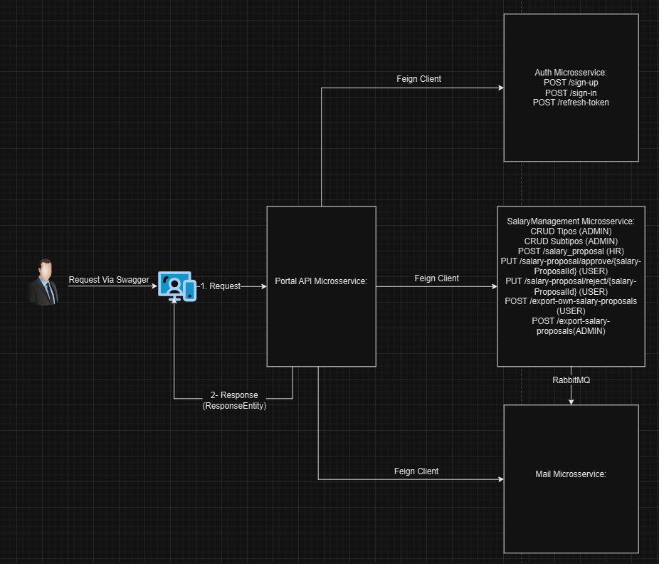
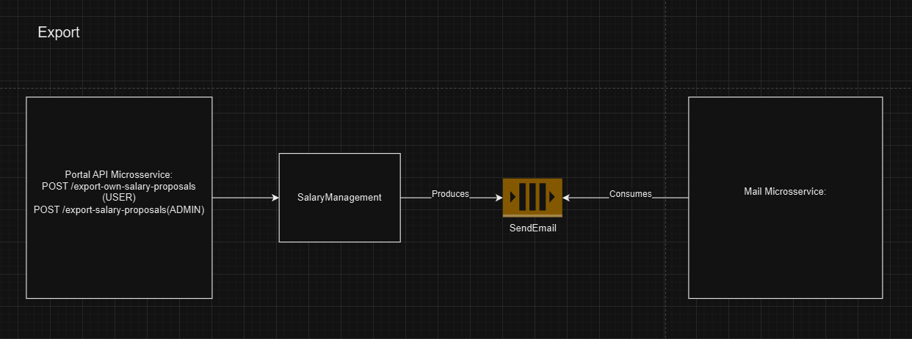

# Spring Microservices Project

This project is my first project developed using Spring Boot. It is a Spring-based microservices architecture consisting of three microservices:

1. **Portal** - Acts as a proxy and delegates requests to the other two microservices.
2. **CollaboratorInfo** - Manages collaborator details.
3. **Authentication** - Manages user authentication, sign-in, sign-up, and token refresh functionality.
4. **SalaryManagement** - Manages collaborator salaries.
5. **MailGateway** - Manages file exportation by email.

The **Portal** microservice serves as the central point for incoming requests and routes them to the appropriate microservices using `FeignClient`.

## Project Structure

The project is divided into three main components:
- **Portal**: Uses FeignClient to communicate with other services.
- **CollaboratorInfo**: Provides endpoints for managing collaborator information.
- **Authentication**: Handles user authentication, including sign-in, sign-up, and token refresh operations.
- **SalaryManagement** - Manages collaborator salaries.
- **MailGateway** - Manages file exportation by email.

---

## API Documentation

### Portal Microservice

The **Portal** service communicates with the `CollaboratorInfo`, `Authentication`,`SalaryManagement`,`MailGateway` microservices by acting as a gateway. Here are the API methods for each client:

---

### Authentication Client (FeignClient)

#### `POST /sign-in` - `JWTResponseDTO signIn(UserCredentialsDTO userCredentialsDTO)`
Authenticates a user and returns a JWT response.

#### `POST /sign-up` - `UserCredentialsDTO signUp(UserCredentialsDTO userCredentialsDTO)`
Registers a new user and returns their credentials.

#### `POST /refresh-token` - `JWTResponseDTO refreshToken(RefreshTokenDTO refreshTokenDTO)`
Refreshes the JWT token for an authenticated user.

---

### CollaboratorInfo Client (FeignClient)

#### `Addresses`
Provides CRUD operations for managing addresses, including endpoints to create, read, update, and delete address records.

#### `Collaborators`
Provides CRUD operations for managing collaborators, including endpoints to create, read, update, and delete collaborator records.

---

### SalaryManagement Client (FeignClient)

#### `Component Types`
Provides CRUD operations for managing component types, allowing users to create, read, update, and delete component type records.

#### `Component Type Subtypes`
Provides CRUD operations for managing component type subtypes, enabling users to create, read, update, and delete component type subtype records.

#### `Salary Components`
Provides CRUD operations for managing salary components, including endpoints to create, read, update, and delete salary component records.

---

#### `Salaries`
Provides CRUD operations for managing salaries, including endpoints to create, read, update, and delete salary records. Additionally, it includes an endpoint to approve salaries:

- **Approval**: Approves a salary by its ID, ensuring it meets the required conditions.

---

#### `Reports`
Provides endpoints for generating and exporting salary reports. The generated reports are sent to RabbitMQ queues for further processing and communication with the Mail Gateway.

- **Export Salaries**: Builds an Excel file with salary data and sends it to the `export-salaries-queue` RabbitMQ queue.

- **Export Own Salaries**: Builds a filtered Excel file with user-specific salary data and sends it to the `export-filtered-salaries-queue` RabbitMQ queue.

---

## Project Setup

### Prerequisites
- Java 21
- Maven
- Docker

## Technologies Used

- **Java 21**
- **Spring Boot 3**
- **Spring Cloud OpenFeign**
- **Spring Security**
- **Spring Data JPA**
- **Lombok**
- **Gradle**
- **Swagger**
- **RabbitMQ**
- **Quartz**
- **JSON Web Token (JWT)**
- **Docker**
- **Liquibase**
- **PostgreSQL**
